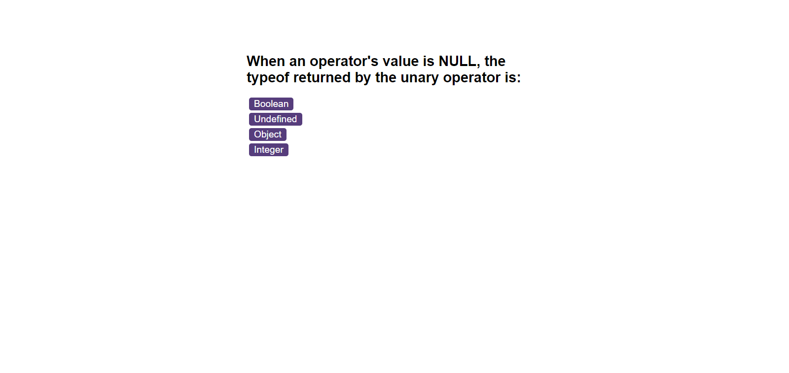

# Code_Quiz

## Description
This is a JavaScript quiz game for students to test their knowledge in JavaScript.
 

## Usage
It doesn't require any installation because it runs in the browser. If you press the "Start Quiz" button you will be redirected to the Questions screen and the timer starts. You will be able to select an answer from 4 answer buttons. You will get an immediate feedback in a form of message and sound letting you know if the selected answer is correct or wrong. You will be redirected to the next question automatically and once you reach the last question or the timer reaches 0 you will be redirected to the end screen where you can see your scores displayed and you can save your initials. If your answer is incorrect then 10 seconds will be subtracted from the time and you will get 1 point for every correct answer. If you click the "View HighScores" link that will take you to the highscores page where you can see your best result displayed from localStorage and compare to other scores. You will be able clear the highscores if you click the "Clear HighScores" button.

Here are some mockup images of the webpage:

And here is the link for the deployed webpage: https://vighimre87.github.io/Code_Quiz/
 

## Credits
N/A
 

## License
Plese refer to the LICENSE file in the repo.